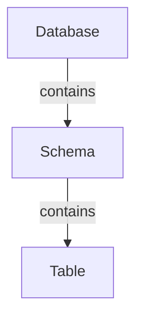

# Geospatial Operations, CTEs, and Joins

---

## Agenda

- More Data types
  - Functions and operators
  - Dates
  - Spatial types
- Spatial operations
- Common Table Expressions
- Joins
- Spatial aggregations

<!--

In this lecture we're going to take another look at data types. We're going to see some common operations on a few of those data types, and we're going to throw spatial data types into the mix, and we'll spend a significant chunk of time talking about the various types of spatial operations you can do with PostGIS. Then we'll talk about using multiple relations in our queries with common table expressions and joins, and we'll finish off with a demonstration that incorporates a number of these concepts.

When there's SQL being run on-screen, I encourage you to follow along on your own computer. If I choose one tool or another to demonstrate with, I'll try to give my reasoning for my choice of tool, but remember that there is not going to be a single right way to do most of the stuff we'll be getting into.

-->

---

# Core Data Type Operations

<!--

In the last lecture we chatted about a few of the data types and the operations you can take on them, but I want to demonstrate a few that are less obvious on the face of them.

-->

---

## Creating a database for my work

<!--

So I'll start by creating a new database for any examples that I do in this lecture. Normally, I would choose to create a database in PGAdmin, or I would use `createdb`, which is a command line program that's installed with the PostgreSQL client tools.  As you've experienced already with other command line tools, it may be necessary to set your PATH environment variable to get it to work correctly, but don't worry about it right now. You don't really need to use the `createdb` command, it's just another option for you to create a database. I prefer it sometimes because I can stay in my code editor, VS Code. It's always useful to have a command line option in my back pocket for various operations.

[RUN TERMINAL COMMANDS]
-->

### In my terminal...

```bash
createdb --host localhost --port 15437 --user postgres musa5090week03
```

<!--

In the command that I just ran I specified my port as 15437, but the port for your database server is probably just 5432 -- the default for a PostgreSQL server. I just use a certain port numbering convention for my postgres servers -- I put a one in front for servers running in docker containers, and I end with 7 instead of 2 to specify the server running PostgreSQL version 17. But that's just my convention. If it were PostgreSQL 16 I'd assign it a port ending in 6. I'm not sure what I'm going to do when PostgreSQL 20 comes out.

There are other ways I could have created this database without leaving VS Code. For example, using the PostgreSQL plugin I could hover over the connection and click the plus button.

[OPEN THE POSTGRESQL PLUGIN, HOVER OVER THE CONNECTION, CLICK THE PLUS]

This will start a CREATE DATABASE SQL statement. Yes, you can create a database using PostgreSQL DDL SQL.

So after I've created my database, because I know I'll be doing spatial stuff today, I have to install the PostGIS extensions into the database. Remember this is something you have to do on each database, if you want to use the spatial extensions. I'll use the PostgreSQL extension in VS Code for this, again so that I can stay in my code editor.

To run a SQL statement against a database with the PostgreSQL extension, all I need is to have a SQL file open. It can be an existing file, or a completely new one.

[CREATE A NEW FILE AND SET THE LANGUAGE TO SQL]

To set the language on a file, I usually use a keyboard shortcut where I press Ctrl+K and them M, and type the language that I want, but I can also just go do to the bottom of the window and select the language mode.

[PRESS ESC, THEN CLICK ON THE LANGUAGE PICKER AT THE BOTTOM OF THE WINDOW]

Now I can run a database query.

[CREATE THE POSTGIS EXTENSION]

-->

### In a database client...

```sql
create extension postgis
```

---

## Download some data

<!--

For these first few quick examples I'm going to load the Indego stations into this new database like we've done in the past. cURL is another command line program I use all the time for downloading data from a URL into a folder. Also not something you need to use neccessarily -- you'll find your rhythm and preferred tools over time.

-->

```bash
curl https://www.rideindego.com/wp-content/uploads/2024/10/indego-stations-2024-10-01.csv \
  | csvcut --not-columns 4-7 \
  > data/indego_stations.csv
```

<!--

In my terminal, I also used something called a "pipe", which is that vertical bar in the terminal command, to send or "pipe" the output from the curl command into the csvcut command. In other words, using the downloaded contents of the CSV file from Indego's website directly as the input for the csvcut command. And then I'm sending the output of the csvcut command to a new file in my data folder. That's what the right angle bracket does.

I'm also going to be taking advantage of schemas this time. You can think of schemas as folders -- organizational aides for your data within a database. I usually think of them as topics for my data. So, all the data relevant to an indego bikeshare topic I'll place in the "indego" schema.

-->

---

## Aside: Database Organizational Terminology

<!--

By the way, different database systems have different names for various concepts. For example, when we talk about BigQuery later in the semester, you'll see that it uses the term "dataset" to refer to the folder-like structures where you put your tables. Honestly, I like the BigQuery terminology better -- it's more straightforward: a set of tables is a dataset. Also, the term "schema" is used for so many things -- the structure of an individual table is referred to as a table schema; the structure of a database overall is called a database schema. So I feel like calling these organizational units "schemas" is just a little confusing. Nevertheless, that's what PostgreSQL calls them.

-->




---

## Load the data

```sql
create schema if not exists indego;
create table if not exists indego.stations (
    station_id   INTEGER,
    station_name TEXT,
    go_live_date TEXT
)

copy indego_stations
from '...path to file goes here...'
with (format csv, header true);

alter table indego_stations
alter column go_live_date type date
    using to_date(go_live_date, 'MM/DD/YYYY');
```

<!--

By the way, different database systems have different names for various concepts. For example, when we talk about BigQuery later in the semester, you'll see that it uses the term "dataset" to refer to the folder-like structures where you put your tables. Honestly, I like the BigQuery terminology better -- it's more straightforward: a set of tables is a dataset. Also, the term "schema" is used for so many things -- the structure of an individual table is referred to as a table schema; the structure of a database overall is called a database schema. So I feel like calling these organizational units "schemas" is just a little confusing. Nevertheless, that's what PostgreSQL calls them.

-->

---

<!--

To place a table in a schema or refer to a table in a schema you can just put the schema name, then a dot, then the table name. We haven't done this with tables so far because PostgreSQL uses a default schema for databases. If you don't explicitly specify a schema, PostgreSQL will look in these default schemas for whatever table you're referring to. It's similar to the PATH environment variable in this way.

-->

If you want to see what the default schemas are you can query the [`search_path` variable](https://www.postgresql.org/docs/8.1/runtime-config-client.html#:~:text=search_path):

```sql
show search_path;
```

<!--

That's the second time we've used the `SHOW` keyword. You can find other database settings that can be looked up with that command at the link in the slides. Note that the SHOW command is PostgreSQL-specific, and as such, the results show up best in PG Admin.

-->

---

## Queries

<!--

We can do some simple queries with this data. Let's start off by looking at the whole table:

-->

```sql
select *
from indego.stations;
```

<!-- Just to demonstrate what we can do with numbers, let's consider just the IDs for a moment, ... -->

```sql
select station_id
from indego.stations;
```

---

### Next consecutive station ID (attempt #1)

<!-- ... and say we are assigning these IDs automatically and consecutively. If we wanted to get the ID of the station that was created after each station we might just add 1 to that station's ID. -->
```sql
select
    station_id,
    station_id + 1 as next_station_id
from indego.stations;
```

---

### Next consecutive station ID (attempt #2)

<!-- There are reasons that you might not want to do something like that (for instance you can see that the stations 3001 to 3004 don't exist). SQL has a feature called WINDOW functions that can help us do this a little better. -->

```sql
select
    station_id,
    lead(station_id) over (order by station_id) as next_station_id
from indego.stations;
```

---

### Station IDs over 3355

<!-- Now let's say we only want to see information about stations that went live at the same time or later than the one with ID 3355. We could use a WHERE clause with a boolean condition to filter the resulting relation: -->
```sql
select *
from indego.stations
where station_id >= 3355;
```

---

### Filtering with dates

<!-- But we don't know if the station_id's are _truly_ monotonic (which is to say, always increasing), so let's use the go_live_date value instead. Let's find the go_live_date for station 3355: -->

```sql
select go_live_date
from indego.stations
where station_id = 3355;

-- 2023-10-12
```

<!-- Then we can use that value to get the actual set of stations: -->

```sql
select *
from indego.stations
where go_live_date >= '2023-10-12';
```

<!-- Even though we use a string to specify the date, behind the scenes PostgreSQL will sneakily try to cast the value to the same type as the field it's comparing against. If you use a string that PostgreSQL doesn't know how to automatically convert then you'll get an error. -->

---

### Using subqueries

<!-- Notice that we had to run two queries above to do what we wanted, but we can do that in one query. -->

```sql
select *
from indego.stations
where go_live_date >= (
    select go_live_date
    from indego.stations
    where station_id = 3355
);
```

<!-- This query uses something called a subquery to get the go_live_date for the station with id 3355. Postgres will first run the subquery between the parentheses, get the result, and then replace the subquery in the main query with that result.

Subqueries are great, but later on we'll see something called a Common Table Expression that makes subqueries even better.-->

---

### Extracting date parts

<!-- Let's say I wanted to know the month of the year that each station went live. We could use the EXTRACT function: -->
```sql
select
    station_id,
    station_name,
    extract(month from go_live_date) as go_live_month
from indego.stations;
```

We can also filter with `EXTRACT`.

<!-- Say we want to see all stations that went live in the 4th quarter, we could use the EXTRACT function in the WHERE clause: -->

```sql
select
    station_id,
    station_name,
    extract(month from go_live_date) as go_live_month
from indego.stations
where extract(quarter from go_live_date) = 4;
```

<!-- This would give us only stations that went live in oct, nov, or dec. -->

---

### Concatenating and filtering with text

<!-- Finally let's see a couple things we can do with TEXT types in SQL. First of all, say we wanted to create a label for each station that included the station name and ID. We could use the string concatenation operator to do that. The concatenation operator is just two vertical bars (you can find the vertical bar above the backslash on your keyboard): -->

```sql
select
    station_id,
    'Name: ' || station_name || ', ID: ' || station_id
        as station_label,
    go_live_date
from indego.stations;
```

<!-- We can also use the LIKE operator on strings when filtering. For example, we could get all the stations that mention Walnut St in their name: -->

```sql
select
    station_id,
    station_name,
    go_live_date
from indego.stations
where station_name like '%Walnut%';
```

<!-- The percent sign is what's called a "wildcard" character. In this case it will match any number of any character in a string. So this SQL finds any station names that have any characters followed by the string "Walnut", followed by any other characters.

There are tons of other functions and operators you can use on core data types, but let's move on to spatial types. -->

---

## Spatial data types

The PostGIS extension to PostgreSQL adds two data types:
- `geometry` - Shapes on a plane
- `geography` - Shapes on the surface of [a sphere](https://github.com/postgis/postgis/blob/fcdf1f229798936166f8b859d4aeb76a2cf5fc39/liblwgeom/liblwgeom.h.in#L137-L149)

<!-- At a high level, the GEOMETRY type is used to represent shapes on a Cartesian plane, and the GEOGRAPHY type is used to represent shapes on the surface of a sphere with a radius that approximates the size of Earth. 

By the way, as a fun side effect of PostGIS being open source, you can actually go and see the exact lines of code where the radius is defined. [SHOW IN THE BROWSER] -->

---

## `geometry` vs `geography`

<!-- So why are both of these data types provided in PostgreSQL? It's because they may come in handy in different situations. Doing calculations on GEOMETRY values are almost always faster than using GEOGRAPHY values -- for example calculating the distance between two points on a plane only requires some multiplication and a square root, whereas on a sphere there are several relatively expensive trigonometric calculations involved. Speed of queries is something that, in practice, people rely on a database like PostgreSQL for. That's not as true in other databases we'll see later like BigQuery.

On the other hand, you have to do additional accounting when using GEOMETRY values -- you have to ensure that values being compared are using the same coordinate reference system, and that the CRS is appropriate for your points, not creating too much distortion. With GEOGRAPHY values there's just less you have to keep track of. -->

|   | Speed | Simplicity |
| --- | --- | --- |
| `geometry` | 🏅 |   |
| `geography` |   | 🏅 |

Interesting (slightly technical) discussion on the speed differences at:
https://medium.com/coord/postgis-performance-showdown-geometry-vs-geography-ec99967da4f0

---

## `geometry` vs `geography`

**The PostGIS documentation [recommends](http://postgis.net/workshops/postgis-intro/geography.html#why-not-use-geography):**
* If your data is geographically compact, use the `geometry` type with an [appropriate projection](http://epsg.io).
* If you need to measure distance with a dataset that is geographically dispersed, use the `geography` type.

They have a little mote detail in their [FAQ](https://postgis.net/documentation/faq/geometry-or-geography/).

**My recommendation? ...**

---

<div style="text-align: center">

<div style="font-size: 2em">

**Use `geography`**

<!-- 

(https://postgis.net/documentation/faq/geometry-or-geography/#:~:text=The%20geometry%20type%20is%20easy%20to%20understand,%20and%20represents%20data%20on%20a%20cartesian%20plane.) 

The PostGIS FAQ on geometry vs geography states: "The geometry type is easy to understand, and represents data on a cartesian plane."

I think this is false (the first part). When I'm using geometries I have to keep more things in mind about my data. I have to pay attention wo when geometries work well as approximations and when they don't. I have to worry about the CRS between different geometry fields. That's not easier to understand for me than geographies.

Most of the data that you're going to put in the database is already going to be in degrees of longitude and latitude, and it's just a cognitive burden that you don't have to worry about. And if you need one of the functions that's only available for geometries, casting to `geometry` is pretty easy if you know the target SRID.

Ultimately, I agree with Jacob Baskin who, in his benchmark comparison between geometry and geography queries in PostGIS says:

(https://medium.com/coord/postgis-performance-showdown-geometry-vs-geography-ec99967da4f0)

> So, if I were starting a new project from scratch, I would use geography regardless of the performance penalty. Why? Remember that you should never optimize prematurely: unless your queries are slow already, or your database load is becoming problematic, it probably doesn’t make sense to try and speed up. And if performance isn’t an issue already, geography is much easier to manage and much harder to screw up.
>
> Once you have your data working with geography, you at least have a baseline: if you do decide to convert your data to geometry, you can at least compare results to ensure the inaccuracy you incur is acceptable. It also allows you to compare performance to understand how much time you are actually saving.

-->

</div>

...until you can't

<!-- If you determine that your queries are too slow, and measuring spatial distance is a common operation, then you may be well served by converting to geometry (we'll see examples where this might be the case in next week's lecture and in assignment #2). In those cases, you may want to note the difference explicitly. For example, you could have a `geog` column and a `geom_32129` column for geometries in EPSG:32129.

Generally, with _all_ software development (and maybe as an overarching design rule everywhere), you should always allow simplicity to win (unless you _need_ the complexity). Do things simple way and switch to the complex way if it proves to be a bottleneck. -->

</div>

---

### Load stations geographic data for examples

<!-- Let's quickly load the geographic data for the Indego stations so that we can compare the accuracy of GEOMETRY and GEOGRAPHY calculations. We can go back to the Indego data page and grab the URL for the station statuses dataset, which is a GeoJSON file that includes station locations.

Now, to be entirely honest, I might normally choose to load this data through QGIS because I'm mainly interested in exploring it right now. However, QGIS will have trouble if you try to load this particular dataset into PostGIS through it. I think it's because of the bikes attribute, which is nested JSON, but I'm not 100% sure -- I didn't take too much time to debug it

However, this is why it's useful to know more than one way to load data in. Ogr2ogr has no problem with this dataset. -->

```bash
curl -L http://www.rideindego.com/stations/json/ \
> data/indego_stations.geojson

ogr2ogr \
-f "PostgreSQL" \
-nln "stations_geo" \
-lco "SCHEMA=indego" \
-lco "GEOM_TYPE=geography" \
-lco "GEOMETRY_NAME=geog" \
-lco "OVERWRITE=yes" \
PG:"host=localhost port=5434 dbname=musa509week03 user=postgres password=postgres" \
"data/indego_stations.geojson"
```

<!-- Nevertheless, QGIS still might be useful for me to verify that my data looks right. If I have a connection to my database set up in QGIS, I can quickly add a layer from any table that has a geometry or geography field. Then, using QuickMapServices plugin, I can throw a basemap under the data, just to verify that the stations are in the right places. This might also be something I choose to use PG Admin for, but either way I'd need something outside of the VS Code PostgreSQL extension, which just shows me a textual representation of my shapes. -->

---

### Measuring distances

Let's measure the distance from each of the stations to City Hall.

<!--

I'm going to use a set of coordinates for City Hall that I gathered before. Generally I use somewhere around longitude -75.16, latitude 39.95 for Philadelphia City Hall.

Now since we loaded this data in with a GEOGRAPHY type, we can be pretty confident in the results.

-->

```sql
select
    id,
    name,
    ST_Distance(
        geog,
        ST_MakePoint(-75.1634, 39.9529)
    ) as dist_geog
from indego.stations_geo
order by dist_geog;
```

<!-- We know now that doing these calculations on geometries is going to be faster, but what would we be trading off in terms of accuracy?

With the way that we're working with this data right now (i.e. it's not a lot of data, and we're running a single distance query on each row, manually), we're not really going to notice a speed difference. Let's focus on the accuracy for now.-->

---

### Reprojecting data

<!-- Let's try using CRS 3857 -- better knows as Web Mercator -- first. The vast majority of maps you look at online use this projection. If you go to Google Maps and zoom all the way out, you're looking at a world map projected into CRS 3857. This projection is nominally based on meters, and if you're very near the equator it's actually quite accurate. But as soon as you get away from the equator it starts to break down.

Often when I intend to work with my data in a specific CRS for whatever reason, I'll create a new geometry column and explicitly name it with the reference system ID that I'm using. Otherwise I feel like I'm omitting the units. For example, if I create a "length" field and don't specify whether the numbers should be interpreted as meters or feet then how would someone know. Same with my geometries.
-->

```sql
alter table indego.stations_geo
    add column geom_3857 geometry;

update indego.stations_geo set
    geom_3857 = ST_Transform(geog::geometry, 3857),
```

<!-- When we cast a geography to a geometry, PostGIS knows it should be interpreted in CRS 4326, so we can use the ST_Transform function to project the geometry value from 4326 to 3857. -->

---

### Measuring distance with Web Mercator

<!-- Now that we have a new column with our data in web mercator we can calculate the distances between city hall and each station in that projection: -->

```sql
select
    id,
    name,
    ST_Distance(
        geog,
        ST_MakePoint(-75.1634, 39.9529)
    ) as dist_geog,
    ST_Distance(
        geom_3857,
        ST_Transform(
            ST_SetSRID(
                ST_MakePoint(-75.1634, 39.9529), 
                4326
            ),
            3857
        )
    ) as dist_3857
from indego.stations_geo
order by dist_geog;
```

<!-- When we created the point for city hall and calculated the distance from our geographies, we didn't need to specify the input spatial reference ID -- that's because PostGIS assumed that we were using a point with latitude and longitude, because that's always the case with geographies. With geometries though, PostGIS can't make such assumptions, so we have to use the ST_SetSRID function to tell the database that our city hall point is in 4326 coordinates.

That's not enough though because PostGIS doesn't like doing calculations on geometries with differing SRIDs -- it wants you to explicitly choose which SRIDs you want to do the calculations in. This makes sense because, if you have a geometry in 4326 and on ein 3857 and you want to find the planar distance, those two coordinate reference systems specify different planes, so it matters which plane you're measuring the distance on.

So, we have to transform our 4326 point into 3857, and then we can finally get a distance value.

But look at the differences between these values! For the closest Indego station to City Hall -- and this one is actually ON city hall's apron, so _very_ close -- it's a 40 meter difference. And if we go down to the bottom of the list, the farthest station is just under 10 km from City hall, but we calculate over 13km in web mercator. That's more than a 30% error at Philadelphia's latitude. -->

---

### Reprojecting data into a local projection

<!-- Now let's try in a local projection. -->

Let's use [PA State Plane South (meters)](https://epsg.io/32129) instead.

<!-- I like using 32129 for Philadelphia data. A lot of data that you'll get from the city of Philadelphia or the state of PA might be in CRS 2272, which is the same as 32129 except it uses feet as it's unit of length. But we're going to use 32129. --> 

```sql
alter table indego.stations_geo
    add column geom_32129 geometry;

update indego.stations_geo set
    geom_32129 = ST_Transform(geog::geometry, 32129),
```

---

### Measuring distance with a local projection

<!-- This is going to look much the same as what we did for web mercator. -->

```sql
select
    id,
    name,
    ST_Distance(
        geog,
        ST_MakePoint(-75.1634, 39.9529)
    ) as dist_geog,
    ST_Distance(
        geom_32129,
        ST_Transform(
            ST_SetSRID(
                ST_MakePoint(-75.1634, 39.9529), 
                4326
            ),
            32129
        )
    ) as dist_32129
from indego.stations_geo
order by dist_geog;
```

<!-- When we get results on this Indego data with CRS 32129 you can see that the values are _very close_ to the geography distance values. Ultimately there's going to be some approximation that's going on when you go from a sphere to a plane, but even when we look at the farthest stations we're getting a difference of less than a tenth of a meter on a nearly 10 km distance.

Projections matter. Data that you load in to your database won't always be in lat, lng, so stay vigilant about it, use the right data types, and name your columns in reasonable ways -->

---

# Spatial Operations
https://postgis.net/docs/PostGIS_Special_Functions_Index.html#PostGIS_SQLMM_Functions

<!-- Generally speaking the operations that you can do in PostGIS fall into five categories: -->

* **Constructors** -- Create spatial data values
* **Transformers** -- Generate new geometries from the input of one or more other geometries
* **Accessors** -- Getting components of spatial values
* **Predicates** -- Determine whether relationships between geometries are true or false
* **Measures** -- Compute measurements with respect to one or more geometries

---

## _Constructors_: Create spatial data values

- Casting from text to geometry/geography
  [Well-known Text](https://en.wikipedia.org/wiki/Well-known_text_representation_of_geometry)
- Functions
  - `ST_GeomFromText`, `ST_GeomFromGeoJSON`
  - `ST_GeogFromText` (oddly no `ST_GeogFromGeoJSON`)
  - `ST_MakePoint`, `ST_MakeLine`, etc. (e.g., on a table with only lat and lng)

<!-- When you have a static value (like the location of Meyerson Hall) it may be easiest to use ST_GeomFromText. When you have a table of latitudes and longitudes, like the Indego trip history, ST_MakePoint may be best. -->

---

## _Transformers_: Generate new geometries from the input of one or more other geometries

- `ST_Buffer`
- `ST_ClosestPoint` (`GEOMETRY` only)
- `ST_Difference` (`GEOMETRY` only)
- `ST_Intersection`
- `ST_Union` (`GEOMETRY` only)

---

## _Accessors_: Getting components of spatial values

- `ST_X`/`ST_Y` (`GEOMETRY` only)
- `ST_Endpoint` (`GEOMETRY` only)
- `ST_Centroid`(`GEOMETRY` only)

---

## _Predicates_: Determine whether relationships between geometries are true or false

- `ST_Contains` (`GEOMETRY` only)
- `ST_Covers`
- `ST_Intersects`
- `ST_Disjoint` (`GEOMETRY` only)
- `ST_Equals` (`GEOMETRY` only)
- `ST_DWithin`

---

## _Measures_: Compute measurements with respect to one or more geometries

- `ST_Angle` (`GEOMETRY` only)
- `ST_Area`
- `ST_Azimuth` (`GEOMETRY` only)
- `ST_Perimiter` (`GEOMETRY` only)
- `ST_Distance`

---

# Common Table Expressions

<!-- A common table expression (or CTE) is a SQL structure that you can use to reduce duplication and increase readablility in your SQL code. A common table expression is basically a virtual table that you create within the context of just a single query. It differs from a subquery in that you can give a CTE a name and then refer to it by that name. -->

---

<!-- Let's use our distance query as an example. In our previous code, we repeated the coordinates for city hall in the query. We also called ST_MakePoint on those coordinates multiple times.

Here we use a CTE to get rid of that duplication. The table that defines our CTE just has a single row, and that row has a single field called geom. We can use a join (specifically a cross join in this case) to tell our final bottom query that it should pull data in from the CTE. We'll talk about joins in a moment.

Finally, we can run the query. The results will be the same as before, but our final query code is a little more readable.

A couple things to note in this code:
1. In the first call to ST_Distance, we're passing in a geography type value and a geometry type value. PostGIS can technically only measure geography values with other geography values, or geometry values with other geometry values. When you try to measure between a geography and geometry value, postgis will attempt to convert the geometries to geographies. This is called implicit casting (like we saw with the string that was automatically converted to a date). However, PostGIS can only cast SRID4326 geometry values to geographies, so geometries in any other coordinate system would have caused an error.
2. The other thing is that PostGIS can only measure between geometries in the same SRID. That is why we had to transform the city hall geometry, which we created as SRID 4326, before we could measure the distance with the PA state plane geometry in SRID 32129. -->

```sql
with city_hall as (
    select
        ST_SetSRID(
            ST_MakePoint(-75.1634, 39.9529),
            4326
        ) as geom
)

select
    id,
    name,

    ST_Distance(
        geog,
        city_hall.geom
    ) as dist_geo,

    ST_Distance(
        geom_32129,
        ST_Transform(city_hall.geom, 32129)
    ) as dist_32129

from indego.stations_geo
cross join city_hall
order by dist_geo;
```

---

# Joins
https://docs.google.com/presentation/d/1cygMG2NvRY6jalYG8rNPv6s8IqSVxEvii1cmhGKXDLU/edit?usp=sharing

---

# Exercise 1 -- Station Density

---

# A few tips for writing queries

---

## Tip 1: Each entity should have a unique identifier

- Think of an "entity" as a real-world thing that is being represented in a table. For example:
  - a bike share station
  - a neighborhood
- Ideally, each table has a column that uniquely identifies each entity (I like calling this column `id`).
- Helps with joins and aggregations.

---

## Tip 2: Be consistent in your style

- It doesn't matter whether you use uppercase or lowercase keywords; just be consistent.
- Always use lowercase/snake_case identifiers (table names, field names, schema names, etc.)
- The linter will help.

---

## Tip 3: Use comments liberally

- SQL, especially when your queries get longer, is very information-dense; your future self will appreciate some context.

---

## Tip 4: Use common table expressions to keep your queries readable*

<!-- Occasionally you'll have to use a query to calculate some intermediate step in your analysis. For those times you'll either use subqueries embedded directly in your query, or you'll use common table expressions.

* I'm aware that, especially if this is all your first introduction to SQL, none of it may look very readable. Once you are more comfortable with the syntax I hope you'll recognize the difference that CTEs make. For now, let's lean toward the CTE syntax. -->

* Common table expressions (CTEs) are a good way to represent intermediate steps in your queries.
* Example: Which neighborhoods have an above- or below-average density of trees?

---

**Without CTEs...**

Step 1: What's the density of trees in each neighborhood?

```sql
SELECT
    nbd.id AS neighborhood_id,
    COUNT(*) / ST_Area(nbd.geog) AS tree_density
FROM azavea.neighborhoods AS nbd
LEFT JOIN phl.ppr_tree_inventory AS tree
    ON ST_Contains(nbd.geog::geometry, tree.geog::geometry)
GROUP BY neighborhood_id
```

---

**Without CTEs...**

Step 2: What's the average neighborhood tree density?

```sql
SELECT
    AVG(tree_density) AS avg_tree_density
FROM (

    -- Calculate tree density in each neighborhood...
    SELECT
        nbd.id AS neighborhood_id,
        COUNT(*) / ST_Area(nbd.geog) AS tree_density
    FROM azavea.neighborhoods AS nbd
    LEFT JOIN phl.ppr_tree_inventory AS tree
        ON ST_Contains(nbd.geog::geometry, tree.geog::geometry)
    GROUP BY neighborhood_id

) AS neighborhood_tree_densities
```

---

**Without CTEs...**

Step 3: Which neighborhoods have an above-average tree density?

```sql
SELECT
    nbd.id,
    CASE
        WHEN COUNT(*) / ST_Area(nbd.geog) > avg_tree_density THEN 'above'
        WHEN COUNT(*) / ST_Area(nbd.geog) = avg_tree_density THEN 'equal'
        ELSE 'below'
    END AS rel_to_avg_density
FROM azavea.neighborhoods AS nbd
LEFT JOIN phl.ppr_tree_inventory AS tree
    ON ST_Contains(nbd.geog::geometry, tree.geog::geometry)
CROSS JOIN (

    -- Calculate average tree density across neighborhoods...
    SELECT AVG(tree_density) AS avg_tree_density
    FROM (

        -- Calculate tree density in each neighborhood...
        SELECT
            nbd.id,
            COUNT(*) / ST_Area(nbd.geog) AS tree_density
        FROM azavea.neighborhoods AS nbd
        LEFT JOIN phl.ppr_tree_inventory AS tree
            ON ST_Contains(nbd.geog::geometry, tree.geog::geometry)
        GROUP BY nbd.id
    ) AS neighborhood_tree_densities
) AS avg_density
GROUP BY nbd.id, avg_tree_density
```

---

**With CTEs...**

Which neighborhoods have an above-average tree density?

```sql
WITH

-- Calculate tree density in each neighborhood...
neighborhood_tree_densities AS (
    SELECT
        nbd.id,
        COUNT(*) / ST_Area(nbd.geog) AS tree_density
    FROM azavea.neighborhoods AS nbd
    LEFT JOIN phl.ppr_tree_inventory AS tree
        ON ST_Contains(nbd.geog::geometry, tree.geog::geometry)
    GROUP BY nbd.id
),

-- Calculate average tree density across neighborhoods...
avg_density AS (
    SELECT AVG(tree_density) AS avg_tree_density
    FROM neighborhood_tree_densities
)

SELECT
    nbd.id,
    CASE
        WHEN nbd.tree_density > avg_tree_density THEN 'above'
        WHEN nbd.tree_density = avg_tree_density THEN 'equal'
        ELSE 'below'
    END AS rel_to_avg_density
FROM neighborhood_tree_densities AS nbd
CROSS JOIN avg_density
```

---

# Let's Practice!

---

## Review results