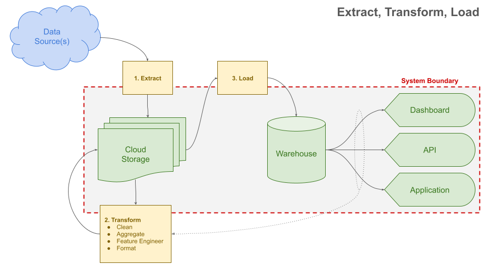
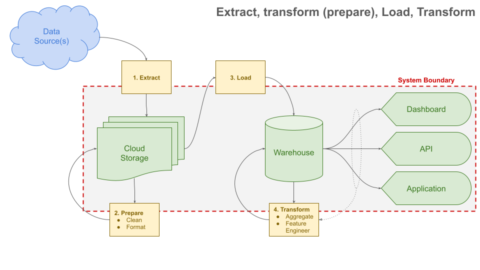

# Scripting Data Pipelines: Extracting and Loading with JavaScript/Python

---

## Agenda

- What (and why) is a data pipeline?
- Scripts for Extracting and Preparing Data
  - Downloading data over HTTP
  - Working with geospatial file formats
  - Working with other file formats (like zip)
- _Next week_
  - _Scripts for loading data into Google Cloud Storage_
  - _Scripts for transforming (running queries) in BigQuery_

---

## What (and why) is a data pipeline?

<!--

I'm not going to go too deep into the basics of what a data pipeline is and why they are important; I'm going to rely on James Densmore for that.

If you haven't read the first chapter, _Introduction to Data Pipelines_, of his _Data Pipelines Pocket Reference_ book you should go and at least skim it now. It's a very good introduction.

We're also going to be talking about extracting and loading data today, so you might want to read the first part of the second chapter, _Extracting and Loading Data_.

Go ahead, pause this and check it out. I'll wait.

-->
Refer to Chapter 1 of _Data Pipelines Pocket Reference_ by James Densmore on [O'Reilly for Higher Education](http://hdl.library.upenn.edu.proxy.library.upenn.edu/1017/7026/1).

---

## ETL vs. ELT

<!-- Now that we have a good idea of what data pipelines are and what they're for, let's talk about some common patterns.

ETL (Extract, Transform, Load) and ELT (Extract, Load, Transform) are two common approaches for data integration and processing. The choice between ETL and ELT depends on a bunch of different factors, including the nature of the data, the processing requirements, and the capabilities of the underlying data platform.

ETL is the more traditional approach, where data is first extracted from the source systems, then transformed or manipulated according to specific business rules, and finally loaded into the target data warehouse.

The diagram here is showing each step of the ETL process. Step 1 is extraction. The extraction step takes data from outside of my system boundary and moves it somewhere inside of the boundary. My system boundary is just an arbitrary line that I've drawn around the things that I'm responsible for.

The second step is transformation. The transformation step is often the most time-consuming part of the process, and is often performed as one big batch job. The specific transformations that are necessary depend on the specific outputs that are a part of the system. We transform data in order to meet the requirements of the system, whatever those requirements are.

The third and final step is loading. The loading step takes the transformed data and puts it into the target data warehouse. This may just be running create external table statements in BigQuery.

In ETL the transformation step is often the most time-consuming part of the process, and is often performed as one big batch job. Preparing the data to load into the data warehouse is done as part of the transform process.

-->



---

## ETL vs. ELT

<!--

On the other hand, ELT flips the order of the transformation step. In ELT, data is first extracted from the source systems and loaded into the target data platform as-is, or with minimal formatting and cleaning done. Afterwards, a light-weight preparation step is performed on the raw data that has been saved into the system. That cleaned, prepared data is then loaded into the warehouse, and finally the transformation step is performed directly within the warehouse using its native processing capabilities, such as SQL queries or built-in functions.

This approach can be more efficient, especially when working with large volumes of data, because it takes advantage of the parallel processing and distributed storage capabilities of modern data platforms.

Transformation still takes time, but it is often done in smaller, more manageable chunks. Also, the intermediate steps are stored in the warehouse, which can be useful for debugging and auditing. It's difficult to emphasize enough how useful having the incremental outputs of the transformation steps already loaded into a data warehouse can be.

Much like anything else we're learning, this isn't a binary choice. You can use a combination of ETL and ELT, or even something else entirely. The important thing is to understand the trade-offs and make an informed decision based on the specific requirements of your project.

-->



---

## ETL vs. ELT

<!-- 
In this class, we're going to primarily stick to the ELT pattern -- or more specifically EtLT. We're going to use Python and JavaScript for the E and L parts, and SQL for the T part.
-->

- We will use ELT (Extract, Load, Transform) in this class
  - More specifically, EtLT
- We will use Python and JavaScript for the E and L parts
- We will use SQL for the T part

---

## Scripting extracts and loads

<!--
Ok, let's get into the details of the E and L parts of the pipeline. We're going to start with the E part, which is the process of extracting data from source systems and making it available for further processing. Really, this is just a fancy way of saying "downloading data from the internet" or "reading data from a file."

We're going to be demonstrating this using a few datasets we've already seen. We'll start with the City of Philadelphia's property tax data, which is available as a CSV file. We'll also look at some geospatial data, which is available as a shapefile. We'll also look at some other file formats, like zip files.

-->

---

**script** 

_(noun)_: a program that is written to be run from beginning to end without interruption, often used to automate repetitive tasks.

_(verb)_: to write a script.

<!--

Importantly we're going to write "scripts" to do these tasks. Try not to overthink what the technical definition of "a script" is. The difference between scripting vs any other type of coding is the intention. In our case, a script is just a program that is written to be run from beginning to end without interruption, and scripts are often used to automate repetitive tasks.

We're going to be doing this in both Python and JavaScript, so you can see how the same process can be done in two different languages. But first we need to get set up with a clean environment for our code.
-->

---

<!--

For example, this is a script you might write to download some data in JavaScript...

[PAUSE for like 5 seconds]

-->

###  Download data (locally) with JavaScript 

```javascript
import https from 'https';
import fs from 'fs';

const url = 'https://opendata-downloads.s3.amazonaws.com/opa_properties_public.csv';

https.get(url, (response) => {
  const f = fs.createWriteStream('opa_properties.csv');
  response.pipe(f);
});
```
Save this as `simple_extract.mjs`.

---

<!--

...and this is a script you might write to download the same data in Python. These two scripts do the same thing: download the opa_properties_public.csv file from the internet and save it to a file called opa_properties.csv on the same computer that the script is running on (probably your computer).

These scripts aren't particularly robust (as they'll each fail if we get a non-successful response from the given URL), but they're also uncomplicated and good starting points for understanding how to write scripts.

-->
###  Download data (locally) with Python

```python
from urllib.request import urlopen

url = 'https://opendata-downloads.s3.amazonaws.com/opa_properties_public.csv'

with urlopen(url) as response:
    with open('opa_properties.csv', 'wb') as f:
        while chunk := response.read(1024 * 1024):
            f.write(chunk)
```
Save this as `simple_extract.py`.

---

### Running a script

<div class="columns-2">
<div>


```bash
python simple_extract.py
```

</div>
<div>


```bash
node simple_extract.mjs
```

</div>
</div>

- The working directory for your terminal matters.
- For Python, you may need to use `python3`
- For JS, we're using an "mjs" extension to let Node know that we're using ES modules (as we should). Read [_ES Modules: All You Need To Know_](https://konstantin.digital/blog/es-modules-all-you-need-to-know) for more.

---

<!--

In the scripts on the previous slides we used a few packages that are built into Python and Node to fetch data (urllib and https, respectively), but each of these languages also has a rich ecosystem of supporting packages. Throughout this work we're going to be using a handfull of useful libraries. Here on this slide are some of those libraries, along with their purposes. Several of these libraries use OSGeo libraries like GEOS, GDAL and PROJ under the hood.

-->

## Useful libraries

| Purpose | Python | JavaScript |
|---------|--------|------------|
| **HTTP requests** | `requests` | `node-fetch` |
| **Reading/writing<br>spatial files** | `fiona`<br><br>`json`\*<br>`csv`\*<br>`zipfile`\* | `shapefile`<br>`@ngageoint/geopackage`<br>`JSON`\* or `big-json`<br>`csv-parse`<br>`adm-zip` |
| **Reprojecting spatial data** | `pyproj` | `proj4` |
| **Transforming spatial data** | `shapely` | `@turf/turf` |

---

## Useful libraries

<!--

Python also has a library called `geopandas` that is very useful for working with spatial data. It's built on top of `pandas`, `fiona`, `shapely`, and `pyproj`, and it's a great way to work with spatial data in Python, though for really large data, using `fiona` and `shapely` along with some of the other libraries on the previous slide can be more efficient.

JavaScript doesn't have a direct equivalent to `geopandas`, but `turf` is a very powerful library for working with spatial data in JavaScript.

-->
Python also has `geopandas`. It's built on top of `pandas`, `fiona`, `shapely`, and `pyproj`, though for really large data, using the underlying libraries along with some of the other libraries on the previous slide can be more efficient.

JavaScript doesn't have a direct equivalent to `geopandas`.

---

### Extract and prepare data as separate steps

Even though we can do both in one step, it's often useful to separate the two steps.

Instead of this:


---

### Extract and prepare data as separate steps

Do this:


---

## Writing our scripts

<!--

Before we can really be ready to write our scripts we have to set up our environment. Specifically, we want to make sure we have our environments set up and that we have a place to declare the requirements. We will need those requirements specified later when we deploy our scripts to the cloud.

-->

---

### Initialize a new folder for code:

<div class="columns-2">
<div>


```bash
mkdir explore_phila_props/
cd explore_phila_props/

python3 -m venv env
source env/bin/activate
```

</div>
<div>


```bash
mkdir explore_phila_props/
cd explore_phila_props/

npm init -y
```

</div>
</div>

> _**Python note**: I prefer to use `poetry` or `pipenv`, but just using `venv` directly is likely the most fool-proof._

<!-- 

One thing that's nice about Node is that there's really one right way to set up a project environment -- that's with npm init. Python has a few different ways to set up a project environment. I prefer to use poetry or pipenv, but _I think_ just using venv directly is likely the most fool-proof. I am sure that I will be proved wrong about that at some point. I know that several students are used to using some form of anaconda, and that's fine too, but just know that I think it's prudent to create a new environment for each project.
-->

---

### Install packages

<!--

Once we have our environment set up, we can install the packages we need. Let's do a more realistic rewrite of the extraction scripts above.

The extraction scripts from before were good for illustration purposes, but they're not particularly robust. We're going to use the `requests` package in Python and the `node-fetch` package in JavaScript to make HTTP requests. These packages are more robust and have more features that make it easier for us to handle errors than the built-in HTTP request libraries.

First let's install the packages we need.

-->

<div class="columns-2">
<div>


```bash
pip install requests
pip freeze > requirements.txt
```

</div>
<div>


```bash
npm install node-fetch
```

</div>
</div>

---

### Modified extract scripts

 `extract_phila_props.py`

```python
import requests

url = 'https://opendata-downloads.s3.amazonaws.com/opa_properties_public.csv'

response = requests.get(url)
response.raise_for_status()

with open('opa_properties.csv', 'wb') as f:
    f.write(response.content)

print('Downloaded opa_properties.csv')
```

---

### Modified extract scripts

 `extract_phila_props.mjs`

```javascript
import fetch from 'node-fetch';
import fs from 'fs/promises';

const url = 'https://opendata-downloads.s3.amazonaws.com/opa_properties_public.csv';

const response = await fetch(url);
if (!response.ok) {
  throw new Error(`HTTP error! status: ${response.status}`);
}

await fs.writeFile( 'opa_properties.csv', await response.text());

console.log('Downloaded opa_properties.csv');
```

<!--

Using the exercise from week05, put together extract scripts for the other data sets mentioned in that README.

-->

---

## Scripting with geospatial files

<!--

Last week we saw a script for preparing a GeoJSON file to load into BigQuery. This week let's take a look at a few more. In the week06 README you should find a guide to a few scripts, namely for preparing data from formats like CSV, Shapefile, and zip (for GTFS data). Look through the scripts in that folder. Your goal should be to read and fully understand what's going on. You should be able to explain what each line of the script is doing. You should also be able to run the script and see the output. If you have any questions, don't hesitate to ask.

-->

---

## Loading data into Google Cloud Storage

<!-- We saw last week how to load files into Google Cloud Storage manually to use as a data source for external tables. In next week's video we're going to script that process. -->
