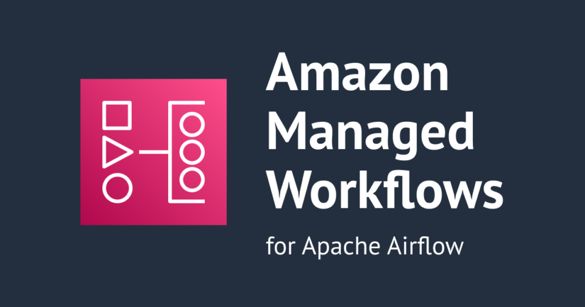
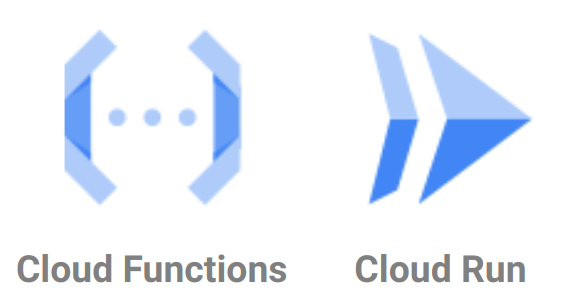
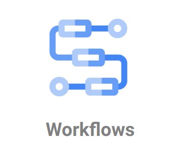
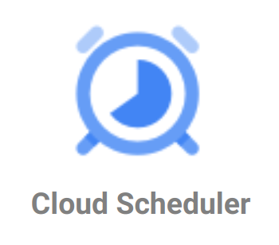

# Implementing ELT with Cloud Services, Part 2
## Deploying to the Cloud 🚀

---

## Agenda

1.  Pipeline orchestration
    - Common open-source tools (Airflow, Prefect, Dagster, etc.)
    - Docker and Kubernetes for development and deployment
2.  Core pipeline concepts
    - Tasks and dependencies
    - Directed Acyclic Graphs (DAGs)
    - Schedules and triggers
3.  Deploying and running pipelines in the cloud
    - The `gcloud` command line tool
    - Cloud Functions and Cloud Run
    - Workflows
    - Cloud Scheduler
4.  Estimating and controlling costs

---

## Recap

In the last video we went through rewriting our extract and process steps to use Google Cloud Storage and BigQuery.  We also talked loading data into BigQuery by creating an external table with a script. Together, these extract and load steps are called "ingestion", and this is _the beginning_ of a data pipeline.

---

## Pipeline Orchestration

The process of managing the execution of a data pipeline.
- Scheduling tasks
- Managing dependencies
- Monitoring task execution

_Examples: [Apache Airflow](https://airflow.apache.org/), [Prefect](https://www.prefect.io/), [Dagster](https://dagster.io/)_

<!--

Pipeline orchestration is the process of managing the execution of a data pipeline. It involves scheduling tasks, managing dependencies, and monitoring the execution of the pipeline.

There are common open-source tools for pipeline orchestration, such as Apache Airflow, Prefect, and Dagster. These tools provide a way to define and execute workflows, and they often include a web-based UI for monitoring and managing the pipeline. All three of these tools use Python for defining workflows, and they can be run on a local machine or in the cloud.

Airflow is probably the most widely used of these tools. In fact, both Google Cloud Composer and Amazon Managed Workflows are versions of Airflow that are managed by Google and AWS respectively; they each run Airflow in the cloud.

We're going to have a guest speaker a next month who will talk about how they've used Airflow in their work on the California Integrated Transit Project.

[https://airflow.apache.org/docs/apache-airflow/stable/howto/docker-compose/index.html]

If you are interested in trying Airflow yourself, the easiest way to get started is probably to use the Docker Compose setup. This will run Airflow in a set of Docker containers on your local machine. In fact, all of these open source orchestration tools can be run in Docker containers, which makes it easy to develop and test your workflows locally before deploying them to the cloud.

https://docs.docker.com/guides/get-started/

Docker is a platform for developing, shipping, and running applications in containers. Containers are a way to package up an application and all of its dependencies into a single file called an "image" that can be run on any machine. This makes it easier to develop and test applications on your local machine, and then deploy them to the cloud without having to worry about differences in the environment. Docker can be a pain to get used to, but it can save you a lot of time and headaches in the long run.

-->





---

## Core pipeline concepts

All of these orchestrators are built around the same core concepts:

- Tasks and dependencies
- Directed Acyclic Graphs (DAGs)
- Schedules and triggers


<!--

All of these orchestrators are built around the same core concepts. At the heart of each of these tools is the idea of a "task" -- a unit of work that needs to be done. Tasks can be anything from running a Python script to copying a file to sending an email.

-->

---

## Core pipeline concepts

All of these orchestrators are built around the same core concepts:

- Tasks and dependencies
- Directed Acyclic Graphs (DAGs)
- Schedules and triggers

.png)

<!--

Tasks can have dependencies on other tasks, which means that they need to be run in a certain order.

-->

---

## Core pipeline concepts

All of these orchestrators are built around the same core concepts:

- Tasks and dependencies
- Directed Acyclic Graphs (DAGs)
- Schedules and triggers

.png)

<!--

For example, we obviously need to extract the data _before_ we can process it, and we need to process the data _before_ we can load it into BigQuery.

-->

---

## Core pipeline concepts

All of these orchestrators are built around the same core concepts:

- Tasks and dependencies
- Directed Acyclic Graphs (DAGs)
- Schedules and triggers

.png)

<!--

We can represent tasks as nodes in a network, with connections between them representing their dependencies. We call this network a Directed Acyclic Graph, or DAG (in computer science, "graph" refers to any network of nodes and the connections between them).

The graph is "directed" because the connections have a direction -- they go from one task to another, denoting the direction of dependency.

The graph is "acyclic" because there are no cycles -- you can't have a task that depends on itself, or on another task that depends on it.

-->

---

## Core pipeline concepts

All of these orchestrators are built around the same core concepts:

- Tasks and dependencies
- Directed Acyclic Graphs (DAGs)
- Schedules and triggers

.png)

<!--

For example, the graph shown here has a cycle. If a graph has a cycle, you can't really tell where you can safely start the pipeline, nor where you can end the pipeline -- you'll end up in an infinite loop.

-->

---

## Core pipeline concepts

All of these orchestrators are built around the same core concepts:

- Tasks and dependencies
- Directed Acyclic Graphs (DAGs)
- Schedules and triggers

.png)

<!--

Note that the order of dependencies in your DAG is important. The DAG shown here is acyclic because the tasks only flow in one direction -- A is a dependency for each B and C, and then each of B and C is a dependency for D. When you reach D, you're done.

-->

---

## Core pipeline concepts

All of these orchestrators are built around the same core concepts:

- Tasks and dependencies
- Directed Acyclic Graphs (DAGs)
- Schedules and triggers

.png)

<!--

On the other hand, this graph has a cycle because of the dependency directions.

-->

---

## Core pipeline concepts

All of these orchestrators are built around the same core concepts:

- Tasks and dependencies
- Directed Acyclic Graphs (DAGs)
- Schedules and triggers

.png)

<!--

Finally, tasks can be scheduled to run at a certain time or triggered to run when a certain event occurs.

-->

---

## Core pipeline concepts

All of these orchestrators are built around the same core concepts:

- Tasks and dependencies
- Directed Acyclic Graphs (DAGs)
- Schedules and triggers

.png)

<!--

For example, we might want to run our pipeline every day at midnight,...

-->

---

## Core pipeline concepts

All of these orchestrators are built around the same core concepts:

- Tasks and dependencies
- Directed Acyclic Graphs (DAGs)
- Schedules and triggers

.png)

<!--

or we might want to run it whenever a new file is uploaded to Google Cloud Storage.

-->

---

## Running pipelines in the cloud
| Pipeline component | Google Cloud service |
| --- | --- |
| _Tasks_ |  |
| _DAGs_ |  |
| _Triggers_ |  |

<!--

As I mentioned before, there are dedicated pipeline orchestration tools such as Airflow that are frequently used, but in this class we're going to construct our DAGs using tools available directly within Google Cloud Platform:
- For running tasks, we can use Cloud Functions or Cloud Run.
- For defining DAGs, we can use Workflows.
- For scheduling tasks, we can use Cloud Scheduler.

-->

---


<!--

Last week I showed this thecloudgirl diagram that helps to explain all the services you can use to run things in Google Cloud. Cloud Run and Cloud Functions are two of the higher-level services that are good for running small tasks that don't need a lot of custom resources. They're great for most self-contined Python or Javascript jobs.

 -->

---

### What is GCP Cloud Functions?

> Cloud Functions is a serverless execution environment for building and connecting cloud services. With Cloud Functions you write simple, single-purpose functions that are attached to events emitted from your cloud infrastructure and services. Your function is triggered when an event being watched is fired, or by an HTTP request.

https://cloud.google.com/functions/docs/console-quickstart

| Other Cloud Company...| Equivalient Service... |
| --- | --- |
| _AWS_ | AWS Lambda |
| _Azure_ | Azure Functions |

<!--

Let's get a sense for what Cloud Functions and Cloud Run are. Cloud Functions is a serverless execution environment for building and connecting cloud services. With Cloud Functions you write simple, single-purpose functions that are attached to events emitted from your cloud infrastructure and services. Your function is triggered when an event being watched is fired, or by an HTTP request.

This basically means that you can write a literal function in Python or Javascript, specify the libraries that the code is dependent on (using standard tools such as a requirements.txt file or a package.json file), and upload the module with your function to Google Cloud. Google Cloud will then run your function whenever the event you specify occurs.

We're going to use Cloud Functions to run most of the tasks in our pipeline, but there are a few tasks where Cloud Run might be necessary.

-->

---

### What is GCP Cloud Run?

> Cloud Run is a managed compute platform that lets you run containers directly on top of Google's scalable infrastructure. You can deploy code written in any programming language on Cloud Run if you can build a container image from it.

https://cloud.google.com/run/docs/overview/what-is-cloud-run

| Other Cloud Company...| Equivalient Service... |
| --- | --- |
| _AWS_ | AWS Fargate |
| _Azure_ | Azure Container Apps |

<!--
Cloud Run is a managed compute platform that lets you run containers directly on top of Google's scalable infrastructure. You can deploy code written in any programming language on Cloud Run if you can build a container image from it.

Whereas you're limited to using a supported language with Cloud Functions, you can use any language with Cloud Run as long as you can build a container image from it. This makes Cloud Run more flexible than Cloud Functions, but it also requires more setup.

-->

---

## Creating a Cloud Function

### [Writing Cloud Functions](https://cloud.google.com/functions/docs/writing)

1. Choose a type ([HTTP]((https://cloud.google.com/functions/docs/writing)) vs Event-driven)
2. Structure your code
3. Write your function

### [(Tips & Tricks) Make your functions...](https://cloud.google.com/functions/docs/bestpractices/tips)
  - **Idempotent:** Can be run multiple times without changing the result.
  - **Stateless:** Doesn't rely on any information from previous runs.

<!--

We're going to convert the scripts we saw last week into cloud functions. At a high-level, our steps will be to choose a type of function (HTTP vs Event-driven), structure our folder in a way that cloud functions can understand, and then write our function.

I recommend you read the cloud functions [tips & tricks](https://cloud.google.com/functions/docs/bestpractices/tips) page in its entirety -- it's not too long. It's a good overview of how to write efficient functions. I'll leave a link in the week 8 README.

Those tips share a lot of advice, but there are a couple of vocabulary terms that I want to go over.

The first term is "idempotent". An idempotent process is one that can be run multiple times without changing the result. This can be important in case something goes wrong and you need to re-run your function, or the entire workflow. For example, say youhave a task that is intended to create a table in your warehouse. If you run the function once, it will create the table with the appropriate data. However, if you run the process again, you probably don't want it to create a completely separate table, or add duplicated data into the existing table. If your function is idempotent, you can run it as many times as you need to without worrying about how your system will change.

The second term is "stateless". A stateless process is one that doesn't rely on any information from previous runs. Stateless processes are meant to be run in response to some event, do their work, and then stop. If you need to keep track of any information between invocations, you'll need to use a database, or some other storage external to the process.

-->

---

### Updating the extract script

- Create a folder -- `extract_data/`
- Add the [appropriate files](https://cloud.google.com/functions/docs/writing#directory-structure) (use `index.mjs` instead of `index.js` for Node)
- Copy the code from week07


<div class="columns-2">
<div>


```bash
pip install \
  functions-framework \
  google-cloud-storage \
  requests \
  python-dotenv
```

</div>
<div>


```bash
npm install \
  @google-cloud/functions-framework \
  @google-cloud/storage \
  dotenv
```

</div>
</div>

<!--

All of the cloud functions we'll be writing will be [HTTP](https://cloud.google.com/functions/docs/writing) functions. This means that they'll be triggered by an HTTP request. We'll need to update our extract script to accept an HTTP request. We can do this with a tool that Google provides called functions-framework.

Let's start by structuring our code appropriately for a Cloud Function. For the most part, each function gets its own folder. However, if there are multiple functions that I know do similar things and have similar dependencies, I may include them in a single folder.

I'll create a folder called `extract_data/` [DO IT], and I'll use the guidance given in the Cloud Functions documentation to create the files that Cloud Functions needs.

https://cloud.google.com/functions/docs/writing#directory-structure

For Python, this is going to be a requirements.txt file and a main.py file. For Node.js, this is going to be a package.json file and an index.mjs file. As the documentation states, by default the Functions Framework is going to look for file named index.js, as is the convention in Node. However, I'm going to use index.mjs because I want to use EcmaScript modules (or ES modules), so I also need to update the package.json file to specify that the main file is index.mjs.

[DO IT]

Now I'll copy the code from the extract script we wrote last week into the respective main.py and index.mjs file. As a reminder, if you're following along, you don't _have to_ do this for both languages -- you can choose one or the other.

[DO IT]

For Python, if you don't have one already, you'll want to create a virtual environment.

[DO IT]

Now, I'll install the Functions Framework package for the language I'm using. For Python, I'll run `pip install functions-framework`, and for Node.js, I'll run `npm install @google-cloud/functions-framework`.

[DO IT]

We will also need to install any packages we used in the previous script. For Python, this is going to be `python-dotenv`, `google-cloud-storage` and `requests`. For Node.js, this is going to be `dotenv` and `@google-cloud/storage`.

[DO IT]

Now let's adapt our code.

https://cloud.google.com/functions/docs/writing/write-http-functions#implementation

For a Python function, we'll need to import functions-framework, and then wrap our code in a function. The function is defined using a special construct called a "decorator". In this case, the decorator comes from the functions-framework library. Finally, since this is an HTTP function, we'll need to return some sort of response content, and maybe a response code too. By default, for Python, we can just return some string and it will assume that we want to return a 200 status code.

For a Node function, we'll also want to import the functions framework (note that our import is going to look a little different than this, because I'll be using the ES module syntax). The function itself will be defined as a callback of the `functions.http` function. Also, similar to the Python function, we'll need to return some sort of response content, and maybe a response code too. In Node, we can use the res.send function to send a response.

Ok, let's get to it.

[VS CODE]

We can name the function whatever we want, but I suggest making the name meaningful -- something like `extract_phl_opa_properties`, for example.

[DO THE IMPORT AND THE FUNCTION WRAP]

And finally we should send some response.

[DO THE RESPONSE]

Now we should make sure that all of our dependencies are up to date. For Node that's pretty easy, as the package.json file updates itself each time we install a new package. For Python, we can either use pip freeze, or we can install and use a tool called pipreqs to update our requirements.txt file based on the packages we actually used.

[OPEN requirements.txt; INSTALL AND RUN pipreqs]
pip install --quiet pipreqs
pipreqs --ignore node_modules --force

Note when I run pipreqs there are a couple things to keep in mind. One, I specify --ignore node_modules because I don't want pipreqs to read any Python files from there (there are some, for whatever reason). Two, there are some packages that pipreqs won't get quire right, like the google-cloud-storage package. pipreqs will think that all modules that start with `google` should require the protobuf package. I'll need to update that manually in requirements.txt by running pip freeze and finding the correct version of the package.

[DO IT]
pip freeze
find google-cloud-storage
copy and paste over protobuf

Great, now our function should be ready to test.

-->

---

### Testing the Cloud Function locally

> Testing a function by re-deploying it after each change requires waiting for deployment each time. By contrast, testing your function directly in your development environment can shorten the iterative test cycle.

https://cloud.google.com/functions/docs/running/overview#local_testing

<!--

As the google cloud documentation states, testing a function by re-deploying it after each change requires waiting for deployment each time. By contrast, testing your function directly in your local development environment can shorten the iterative development cycle.

In other words, it benefits us to run our code to make sure it works locally before we send it to the cloud.

We can do that with the functions-framework that we installed earlier. The commands to run the framework are different for Python and Node, but similar enough. In each case, we run the framework from the same folder as the code lives in (though we can specify an additional argument if we're running from a different folder), and we use the "target" option to specify the name of the function within the module. For Python, we also specify the "debug" option to get more information about what's happening. This is the default behavior for Node.

[DO IT]
functions-framework --debug \
  --target extract_phl_opa_properties

Now this will start a local server that we can access in our browser. We can go to http://localhost:8080 to see the output of our function. Anything we told the function to print (or console.log in the case of Node) will show up in the terminal where we ran the command, and the final text that we responded with will show up in the browser.

[DO IT]
http://localhost:8080

Great, our Python function still works. Now let's test the Node function.

[DO IT]
npx @google-cloud/functions-framework \
  --target extract_phl_opa_properties
go to http://localhost:8080

Here we get an error. Why? It looks like the script thinks we didn't specify a bucket name. But we did, in the .env file, if you'll recall. The problem is that that .env file is not in the same folder as the script -- it's in the parent folder. While the python-dotenv package will search parent folders for the .env file, the Node dotenv package will not. We could move the .env file into this function's folder, but it would be nice if all the functions we create could use the same .env file.

To get our Node function to search in ancestor folders, we can use the find-config package. We'll install it and then update our code to use it.

[DO IT]
Make the terminal a little bigger.
npm install find-config
Shrink the terminal again.
Add the code.

Great, now our functions are tested, and we're ready to deploy them to the cloud.

-->

<div class="columns-2">
<div>


```bash
functions-framework --debug \
  --target extract_phl_opa_properties
```

</div>
<div>


```bash
npx @google-cloud/functions-framework \
  --target extract_phl_opa_properties
```

</div>
</div>

---

## Deploying pipelines to the cloud
1.  [Install the Google Cloud CLI](https://cloud.google.com/sdk/docs/install), i.e. the `gcloud` command line tool
2.  Create a [.gcloudignore](https://cloud.google.com/sdk/gcloud/reference/topic/gcloudignore) file:

    ```yaml
    # Node or Python generated files
    node_modules/
    env/
    *.pyc

    # Data generated while testing
    *.[csv|zip|gpkg|json|jsonl]

    # The .gcloudignore file itself
    .gcloudignore
3.  [Deploy a Cloud Function](https://cloud.google.com/functions/docs/deploy) with the `gcloud` tool

<!--

So how do we deploy our code to the cloud? "Deploying" your code basically means installing your code on a cloud service. In Google Cloud Platform, there are ways to install almost anything you need to from the GUI console in your browser (and I'll leave a link in the README for this week where you can find how to use the GUI to upload a cloud function), but a very common way to deploy code is to use the `gcloud` command line tool.

The `gcloud` tool is a command line interface for Google Cloud Platform. It allows you to interact with Google Cloud services from your terminal. I also recommend using gcloud to deploy your code because you will be able to save the exact commands you used to deploy your code, and you can use those commands to deploy your code again in the future.

https://cloud.google.com/sdk/docs/install-sdk

I've left a link to the instructions for installing the `gcloud` tool in the README for this week.

Once you have the `gcloud` tool installed, you can use it to deploy your code.

https://cloud.google.com/functions/docs/deploy

The command to deploy a cloud function is `gcloud functions deploy`. You'll need to specify the name of the function, the region you want to deploy it to, and the runtime you're using. You can also specify other options, such as the amount of memory you want to allocate to the function, or the maximum amount of time the function can run.

Google provides a handy dandy template that you can use to construct your deploy command. You can find it at the link I've left in the README for this week. You can name the function whatever you want, but it makes sense to name it the same as whatever your function is called in your code.

extract_phl_opa_properties

There are generation 1 and generation 2 functions. You should use generation 2. For my region, I'm going to use us-central1. You can find a list of all allowed region locations linked below. For the runtime, you should choose an appropriate one for your language. You can also find a list of the acceptable runtime IDs linked below.

[OPEN THE LINK]

Generally I'd just recommend using the latest runtime available for your language. I'll use python312 or nodejs20. The runtime you choose will tell Google Cloud Functions how to find the right function in your code. If I choose a python runtime, Google Cloud Functions will know to look in the main.py file for the function I specified. If I choose a node runtime, it will look in the index.mjs file.

python312

For the source, you want to specify the folder where your function is on your local computer. Since I'm going to run this from the folder that the function is in, I can just use a period to specify the current folder, or I could omit the source option entirely as the current folder is the default value.

put a dot

The entry point is the actual name of the function (or the label of the function in the case of Node) in your code. So, in my case, that's going to be extract_phl_opa_properties.

extract_phl_opa_properties

For the trigger, I'm going to specify --trigger-http. This tells Google Cloud Functions that I want to trigger the function with an HTTP request. You can read about the other values below.

[COPY THE COMMAND TO A FILE CALLED DEPLOY.md]

There are other options that you can specify (and might need to) for the environment that your function runs in.

https://cloud.google.com/sdk/gcloud/reference/functions/deploy

A few things I can think you'll want to specify are:

1.  --service-account: The service account that the function runs as. Each service account is assigned an email address, and that's what you want to put here.

    [FIND THE SERVICE ACCOUNT EMAIL ADDRESS AND ADD TO THE DEPLOY.md FILE]
    [PAUSE FOR A BEAT AND GO BACK TO THE DEPLOY DOCS]

2.  --timeout: We won't set this now, but it represents the maximum amount of time your function is allowed to run. For some operations you may need longer than the default 60 seconds. How will you know? Well, if you run your function and it fails, then you need more time. I'd recommend timing how long your function takes and setting the timeout to about twice that amount.

3.  --memory: Because we didn't do much to optimize the amount of memory our function uses, we'll probably need more than the default 256MB. Just thinking about it, our function downloads a file that's about 500MB, and then reads that file in. So, my guess is we'll need about 1Gi or 2Gi. I recommend you find out how much memory you need by trial and error. Set it to the minimum you think you'll need, run your function, and observe how much memory was actually used. Then update your function to use that much memory plus a reasonable buffer.

    I'm going to specify the memory as 1Gi to start.

    [SET THE MEMORY TO 1Gi IN THE DEPLOY.md FILE]

Now we can run the command we've constructed.

[DO IT]

It asks us whether we want to allow unauthenticated invocations. If we allow unauthenticated invocation, it basically means that anyone with the URL to our function can run it. There are cases where we want this to be allowed (for example, if we're building a public API), but for our purposes, we are creating these functions as parts of an internal data pipeline, so we don't want unauthenticated invocations. We can say no here. In fact, we can add an option to the deploy command to specify that we don't want unauthenticated invocations.

[ADD THE OPTION TO THE DEPLOY.md FILE]
--no-allow-unauthenticated
[CONTINUE WITH THE DEPLOY]

It will take a while to deploy the first time. Subsequent deployments will be faster.

-->

---

### Testing the Cloud Function in the cloud

- Trigger the function; either...
  - Use the **Testing** tab in the Cloud Functions UI in the GCP console
  - Use the [`gcloud functions call` command](https://cloud.google.com/sdk/gcloud/reference/functions/call), e.g.
    ```bash
    gcloud functions call extract_phl_opa_properties
    ```
- If necessary, review the logs for error information; either...
  - Use the **Logs** tab in the Cloud Functions UI in the GCP console
  - Use the [`gcloud functions logs read` command](https://cloud.google.com/sdk/gcloud/reference/functions/logs/read), e.g.
    ```bash
    gcloud functions logs read extract_phl_opa_properties
    ```

<!--

Once the function is deployed, we can test it in the cloud. There are a couple of ways to do this. The first way is to use the Testing tab in the Cloud Functions UI in the Google Cloud Platform console.

[OPEN THE CLOUD FUNCTIONS UI]

For this function you don't have to worry about the data that you would send to the function; the function doesn't take any of that into account. You can leave it as is, or just make it an empty JSON object.

[DO IT]

Now scroll down to the bottom and you can run the given command in a cloud shell. You could copy the command and run it in your terminal, but if you're going to do that, you might as well just use the gcloud command line tool.

[GO BACK TO VS CODE]

It's actually pretty easy to do. You just specify `gcloud functions call` and then the name of the function. In my case, that's `extract_phl_opa_properties`.

[DO IT]
gcloud functions call extract_phl_opa_properties

This will run the function and return the response in your terminal.

[WAIT]

As you can see, we got a 500 error. That means that something went wrong in our function. Bummer.

[GO BACK TO THE SLIDES]

So, now we want to figure out what went wrong. If you recall, when we ran the cloud function locally, we could see any errors in the terminal, but when we run the function in the cloud, we can't see the terminal. Instead, we can look at the logs. Everything that would be written to the terminal is instead written to the logs in the cloud. Just like for calling the function, there are a couple ways we can review the logs from a function run. The first way is to use the Logs tab in the Cloud Functions UI in the Google Cloud Platform console.

[OPEN THE LOGS TAB]

You can see the logs for the function run here. You can see that the function was called, and you can see the error message that was returned. However, if you want to stay in the terminal, you can use the `gcloud functions logs read` command. You just specify the name of the function, and it will return the logs for the function run.

[DO IT]
gcloud functions logs read extract_phl_opa_properties

Be prepared for the log lines to be pretty long. You can also control how far back in the logs you're looking by specifying a --limit value. It's 20 log lines by default. Looking at these logs we can see that the issue is that the function doesn't think we set a bucket name. Locally we did that in a .env file, but to set environment variables in the cloud, we can use the `--set-env-vars` option.

[OPEN THE .env FILE AND COPY THE BUCKET NAME]
[ADD THE ENVIRONMENT VARIABLE TO THE DEPLOY.md FILE]

Now we'll re-deploy the function.

[DO IT]

And we'll call the function again.

[DO IT]

Excellent news: it worked!

I'm going to quickly update the prepare step as a function as well, so that we can start talking about chaining these together.

[DO IT]
-->

---

## Workflows

> Workflows is a fully managed orchestration platform that executes services in an order that you define: a workflow. These workflows can combine services including custom services hosted on Cloud Run or Cloud Functions, Google Cloud services such as Cloud Vision AI and BigQuery, and any HTTP-based API.

https://cloud.google.com/workflows/docs/overview

(It's basically creating a flowchart)

<!--

Now that we have more than one function, we need a way to chain them together in the right order. We're going to use Workflows.

Workflows can be created with the gcloud tool, and we will eventually, but I think it's easiest to understand them if we can see what's going on, so let's start in the console.

[GO TO WORKFLOWS IN THE CONSOLE]

Let's create a new workflow

[CLICK TO CREATE]

I'll call my workflow phl-property-data-pipeline. These workflow names only need to be unique within the project, so you can name them whatever you want.

I'm going to use us-central1 again for my region, and I'll select the data-pipeline-robot that we've been using (though I will have to give it some new permissions). We can skip by all the other options and leave them as defaults (though we'll come back to that Trigger option later).

[CLICK NEXT]

Workflows uses this YAML syntax to define a workflow. YAML is a lot like JSON, except with less punctuation. It's a way to represent data in a way that's easy for humans to read and write. It's used a lot in configuration files.

In a workflow YAML configuration, each task within the workflow is called a "step", and you give each step a name. Each step is some kind of operation. Most operations are some kind of calls. You can see the complete list of calls that steps can make in the documentation.

syntax reference -> Standard Libary reference

For example, let's replace a couple of the "call" steps in this workflow with the steps that will call the functions we created. We want to do an http call, and specifically an http.post call, since cloud functions expect you to make a POST request.

[GO TO http.post]

The arguments that we'll be concerned with are the URL, which we will use to point to our cloud function, and the auth, which we have to use for authenticated functions. Google will send along the credentials of the service account that's running the workflow.

[GO BACK TO THE WORKFLOW]
[REPLACE THE CALL STEPS]

OIDC in the auth arguments stands for OpenID Connect, which is a standard for handling authentication. We don't have to worry about it too much, but Google uses it for communication between services.

So now we have a simple workflow that looks about right. We can deploy it by clicking the "Deploy" button.

[CLICK DEPLOY]

And we can run it by executing the workflow.

[CLICK EXECUTE]
[CLICK EXECUTE AGAIN]

And it failed. Why? Well, it looks like the workflow doesn't have permission to call the function. We can fix that by giving the service account the right permissions. Let's pop over to IAM and give the service account the Cloud Run Invoker role. Version 2 Cloud Functions are built on top of Cloud Run, so that's why we need to be able to invoke or run Cloud Run services.

Let's pop back over to the workflow and try to run it again.

[CLICK EXECUTE AGAIN]

Great, looks like it's on it's way. Again, we can do all of this on the command line with gcloud, but I wanted to show what it looks like first.

[Wait for it to finish?]

Now, we don't want to click that execute button every time we need the workflow to run. We want it to run automatically. We can do that with a trigger. We can set up a trigger to run the workflow on a schedule, or when a certain event occurs.

[CLICK <-, AND THEN EDIT]

If we go back to edit the workflow, and then scroll down to the trigger section, we can add a trigger. Let's have the workflow run on a schedule. I'm going to call it phl-property-data-pipeline to match the workflow (though I don't have to). The frequency is specified in cron syntax. I like using https://crontab.guru/ to help me write cron expressions. Let's say we have the workflow run once per week, a couple days before class, on Mondays at midnight in US/Eastern time.

0 0 * * 1
[CLICK NEXT]

And we'll have the same service account manage the schedule. But we'll have to add one more permission to the service account. We'll have to give it the Workflows Invoker role so that it can run the workflow.

[CLICK DONE]

And we're done! In theory, our workflow will run next Monday. We can check the logs to see if it did, and we'll see any errors we need to address in class.

[CLICK NEXT]

I'm going to copy the YAML for the workflow to a file called phl-property-data-pipeline.yml, so that it's easy for me to keep in my source control and track changes to the file.

[DO IT]
[CLICK DEPLOY]

I'll also add the command to deploy the workflow to the DEPLOY.md file.

[DO IT]

I'll leave a link to the documentation for the gcloud workflows deploy and run commands in the README for this week.

-->

---

- Cloud Scheduler

---

## Estimating and controlling costs

---


---

## In re: being more efficient in the cloud
### But first ... files, and streams, and buffers (oh my 🦁!)

<div class="columns-2">
<div>


In python there are **file-like objects**. Typically any functions that read or write data will take a file-like object argument.
- For example, `csv.reader`, `json.load`, `zipfile.ZipFile` all accept file-like objects
- We can use `open` to open a file on disk, or we can use `io.StringIO` or `io.BytesIO` to treat any `str` or `byte` data like a file.

</div>
<div>


In Node.js, we'll most frequently either use **streams** or **buffers**. Streams are a way to read and write data in chunks.  Buffers are used to represent a sequence of bytes.
- For example, `fs.createReadStream` and `fs.createWriteStream` are used to read and write data in chunks
- We can use `Buffer.from` to convert a `String` or `Array` object into a buffer.


</div>
</div>

---

# The rest of the semester!

---

## Guest Speakers

- Talk about their work and how they use data pipelines.
- **March 23: Matthew Klovski at [Regrid](https://regrid.com/)**
- **April 5: Laurie Merrell on the [Cal-ITP](https://www.calitp.org/) project.**

<div class="columns-2">
<div style="text-align: center;">


</div>
<div style="text-align: center;">


</div>
</div>

---

## In-class Project

<!-- We're going to do an end-to-end build of a municipal data product. -->

- **Property Taxes Platform**

  Property taxes are hard (from administrative and policy perspectives), and they're hard to understand (from the resident perspective).  We're going to build a platform that makes it easy for residents to track and compare their property valuations and taxes, and for city officials to keep their tax valuations up-to-date.

- We have the tools!

- Follow-alongs and in-class exercises.

---

## Your Final Projects

- Build a data product.
- Groups of up to 3 students.
- Presentations May 3 & 10.

